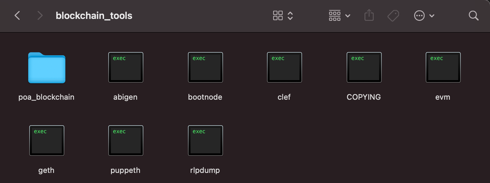
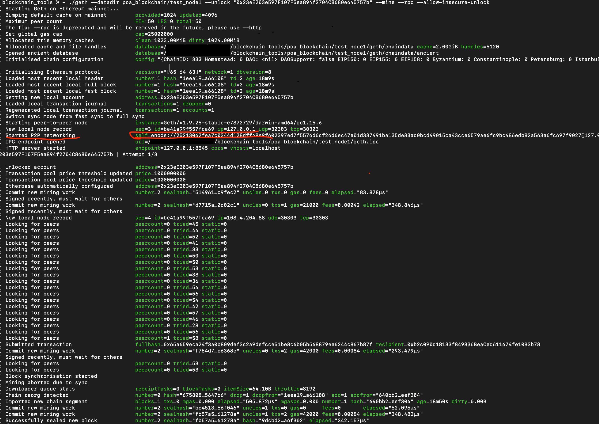
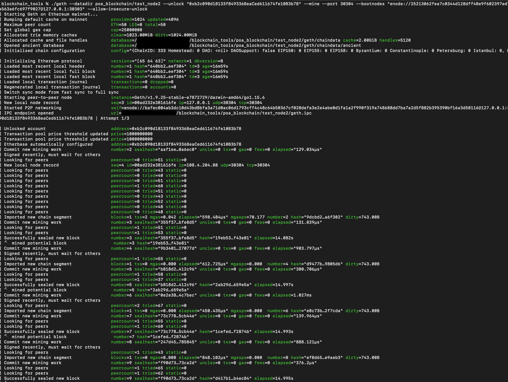
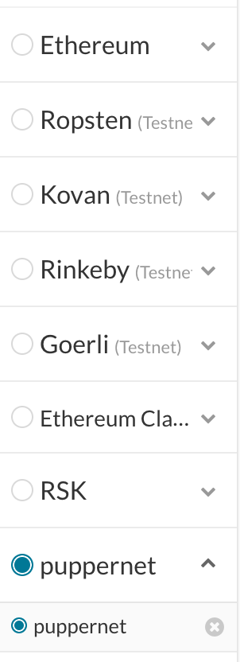
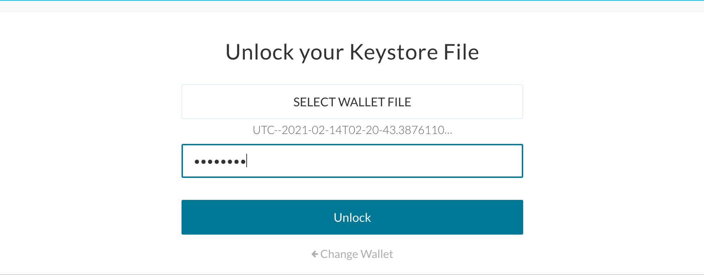
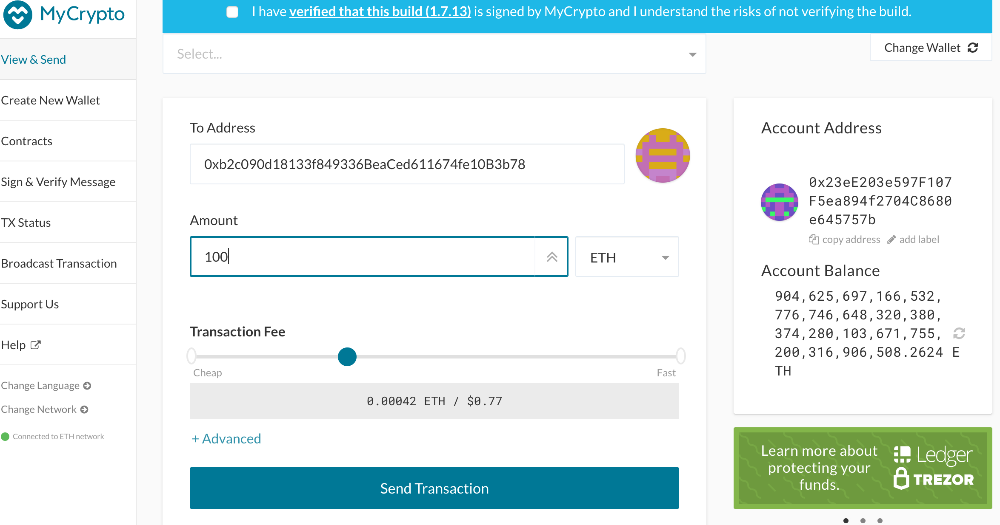
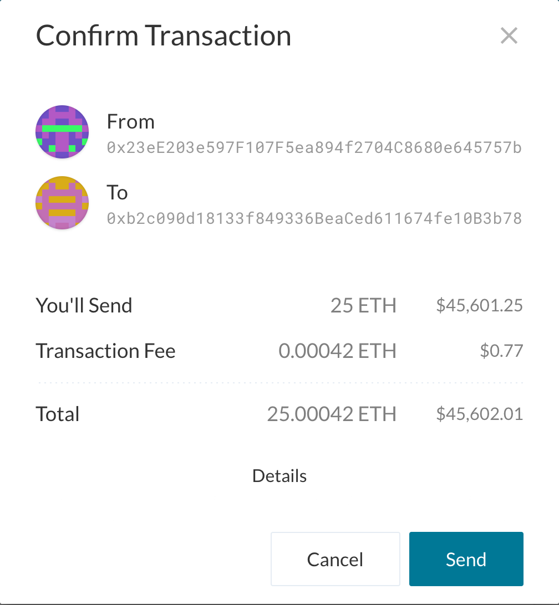
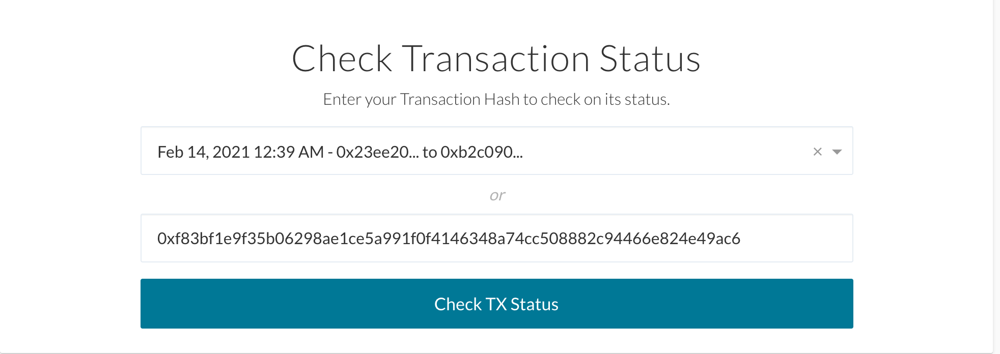
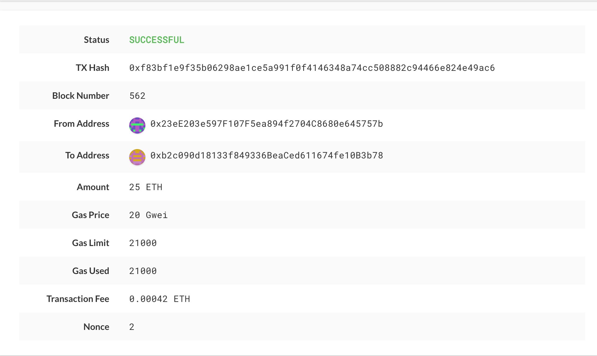

# Power of Authority(PoA) Blockchain

Tools Used<br />

Geth tools for configuring the chain
https://geth.ethereum.org/downloads/<br />
MyCrypto for transacting on the chain.
https://download.mycrypto.com

*For the purposes of this project the tools were placed in the blockchain_tools directory.*



Account configuration in Geth:
account names= test_node1 and test_node2<br />
account passwords= learning (for both)<br />
test_node1 address= 0x23eE203e597F107F5ea894f2704C8680e645757b<br />
test_node2 address= 0xb2c090d18133f849336BeaCed611674fe10B3b78<br />
Network configuration in puppeth(an Ethereum private network manager):<br />
ChainID= 333,
Blocktime= default(15seconds)<br />
Ports used:
test_node1= 30303
test_node2= 30304

- From Terminal change directory to blockchain tools.
- To start the first node run the following command:
```bash
 ./geth --datadir poa_blockchain/test_node1 --unlock "SEALER_ONE_ADDRESS" --mine --rpc --allow-insecure-unlock
 ```
 --datadir flag denote the datadirectory path, in this case its poa_blockchain/test_node1<br />
 --unlock flag unlocks the account after keying in the password that was created during geth account creation.<br />
 The --mine flag tells the node to mine new blocks.<br />
 The --rpc flag enables us to talk to our second node, which will allow us to make transactions on the chain by through MyCrypto.<br />
 --allow-insecure-unlock flag allows communication access through HTTP.
 Replace "SEALER_ONE_ADDRESS" with the public address of test_node1 that was generated during node initalization via geth.<br /> 

So the command for the first node should look like this:

```bash
 ./geth --datadir poa_blockchain/test_node1 --unlock "0x23eE203e597F107F5ea894f2704C8680e645757b" --mine --rpc --allow-insecure-unlock
 ```
Once the node is running you should see this:


 *The enode address is used with the --bootnodes flag when starting the second node.*


* To start the second node (test_node2) open a new tab in terminal and run the following command:
```bash
 ./geth --datadir poa_blockchain/test_node2 --unlock "0xb2c090d18133f849336BeaCed611674fe10B3b78" --mine --port 30304 --bootnodes "enode://25213062fea7c0344d128dff48e9f602397ed7f5576d6cf26d6ec47e01d337491ba135de83ad0bcd49015ca43cce6579ae6fc9bc486edb82a563a6fc697f9027@127.0.0.1:30303" --allow-insecure-unlock
 ```
The second node has additional flags:
The --port flag is used to specify a port that isn't being used. Since the first node is using the default port (30303), we have to specify an open port for the second node.<br />
The --bootnodes flag allows you to pass the network info needed to find other nodes in the blockchain. This will allow us to connect both of our nodes.




## Transacting on MyCrypto
* Open MyCrypto and select puppernet network



* Import keystore file `test_node1/keystore` into MyCrypto and unlock private key by entering password(same as account password)



* Insert the public address for test_node2 in the "To address" field.
* Type the amount of the transaction you like.
* Click "send transaction", then confirm.

 

* You'll get TX hash for the transaction and you can use that to check the status of the transaction.

 

### Success!




